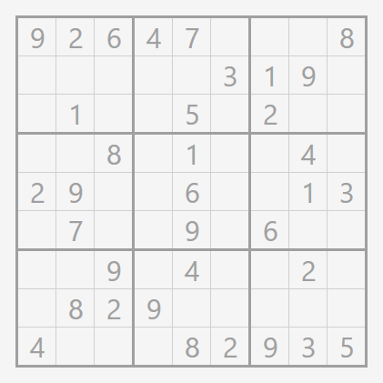
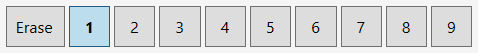
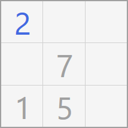
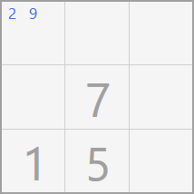
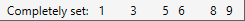
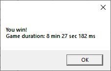
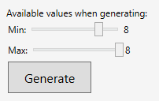
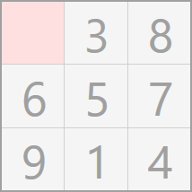
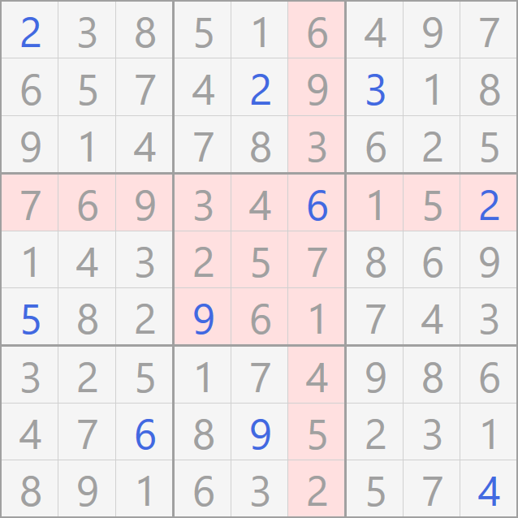
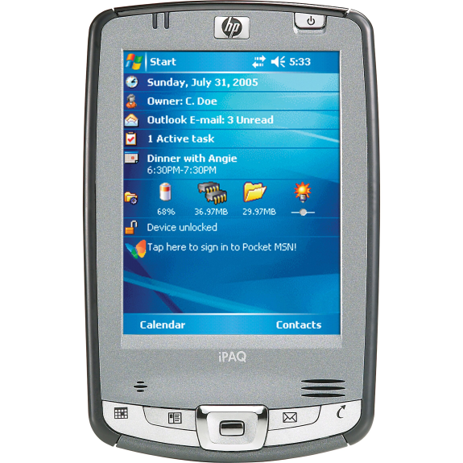

# Overview

Sudoku is a very simple game, and this application is an implementation based on .NET and WPF.<br/>
It runs only on Windows.

## Rules

The board contains 81 cells dispatched on 9 lines and 9 columns, or 9 squares of 9 cells each.<br/>
Each number, from 1 to 9, can appear only once per line, once column, and once per square of 9 cells.<br/>
That's it.

When the game start, the application generates a pre-filled grid, and you have to finish fulfilling it, respecting the rules described above.



## Prerequisites

To run this application, the bare minimum you need is .NET Core Runtime, version 3.1 or higher.</br>
You can download it here: https://dotnet.microsoft.com/download/dotnet-core/current/runtime

Note that you can also build and run the game yourself from the source code. See related section below for more details.

## Download

You can download a pre-built version of the game, here: [Download version 1.0.0](./Download/Sudoku_1.0.0.zip?raw=true)

You can access all the available versions here: [All downloads](./Download)

Once you downloaded the ZIP archive, extract anywhere you want, and execute `Sudoku.exe`.

## Build the game

If you want to build this game yourself from the source code, you need to clone this repository, and also install either:
- Visual Studio 2019 Community edition<br/>
or
- .NET Core SDK

Both are completely free.

### Visual Studio

Download Visual Studio 2019 Community edition here: https://visualstudio.microsoft.com/vs/<br/>
Then open the solution file `Sudoku.sln` and press F5 key.

### .NET Core SDK

Download .NET Core SDK (not "runtime") here: https://dotnet.microsoft.com/download (and chose SDK)<br/>
Then, open a command line in the root folder of the repository, go to the `Sudoku` folder and run the application, with the following commands:
```sh
cd Sudoku
dotnet run
```

## How to use

### Value selector

At the top of the application is the value selector. It allows you to select the value to input in the grid.<br/>
It also includes the `Erase` button, which lets you erase a previously set value.

You can also use your keyboard numbers to select the number you want to input. The number `0` selects the `Erase` option.



The currently selected value can be used to set a definitive value, or to set a possible value. More details below.

### Set a definitive value

After you selected the number to input via the value selector, do main click/tap in a cell to set its definitive value.<br/>
Of course, it is not definitive in a sense that you can always change it or erase it if you made a mistake.

The value you set are displayed in blue, value given when the grid as been generated are displayed in gray.



### Erase a definitive value

After you selected the `Erase` option in the value selector, do main click/tap in a cell to erase its definitive value.<br/>
This as no effect on cells with no definitive value set, and does not erase possible values.

Alternatively, you can perform a middle click/tap to erase a definitive value, regardless of what number is selected in the value selector.

***Note:** if you do not have a middle click/tap available, you can press `Control` key on your keyboard while doing main click/tap to perform the same action.*

### Set a possible value

Sometimes you are not sure what is the definitive value, but have an idea of what are the possible values.<br/>
In this case, select a value via the value selector, and do secondary click/tap in a cell.

***Note:** if you do not have a secondary click/tap available, you can press `Shift` key on your keyboard while doing main click/tap to perform the same action.*

Doing this will toggle the possible value. This as no effect is a definitive value is already set in the cell.



Here the values 2 and 9 are marked as possible values for this cell.

### Completely set indicator

The the bottom right of the application is an indicator telling you what are the numbers that are completely set.



Here we can see all numbers are completely set, except numbers `2`, `4` and `7`.

**Warning:** In order to not make it too easy, it does not tell you if they are correctly placed, it just tells you that the number is set 9 or more times.

### New game

Once you win a game, you should see this window, also indicating the time you needed to complete the Sudoku:



Click `OK` and then click the `Generate` button. Note that you can generate a new Sudoku at any time.



The `Min` and `Max` parameters determine the number of given values the Sudoku starts with. The `Min` value is capped between 1 and the `Max` value, and the `Max` is capped to the `Min` value and 8.

It is not possible to generate Sudoku with 9 values given, for obvious reason :)

Once you have set the `Min` and `Max` parameters, click the `Generate` button to produce a new Sudoku grid.

### Check

At anytime during the game, you can check the grid by clicking the `Check` button.<br/>
In your interest, use this feature only when you are stuck.

If at least one cell is not set, the check feature indicate you where the value is missing.



If all cells are fulfilled but the game still does not tell you that you won, that means you probably set an incorrect value.<br/>
Again, the `Check` button can help you. In this case, it displays which square, column and row are incorrect.



## History

I have recently unearthed this project, which I originally created back in the early 2000's, and was running on Windows Mobile 5.0 and .NET Compact Framework, on this PDA.<br/><br/>



<br/>

Wikipedia pages:
- OS and runtime: https://en.wikipedia.org/wiki/Windows_Mobile_5.0
- Hardware: https://en.wikipedia.org/wiki/IPAQ

The original implementation was the `SudokuLib` library project available in this repository as the Sudoku engine, and the GUI was a WinForms implementation.<br/>
The WinForms project was broken because of missing parts, due to the fact that back then I didn't have any source control.

I just modernized the code in the `SudokuLib` project (almost no work) and made it a .NET Standard 1.0 library, and reimplemented the GUI with WPF targeting .NET Core, and here we go.
